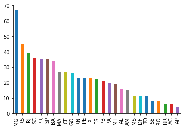

# Dataset Pronatec


```python
import pandas as pd
```


```python
#importa o arquivo csv para uma variavel
df = pd.read_csv('dataset//pronatec.csv', sep =';', encoding = 'cp1252')
```


```python
#mostra cabeçalho do arquivo e mais 5 registros
df.head()
```


<div>
<style scoped>
    .dataframe tbody tr th:only-of-type {
        vertical-align: middle;
    }

    .dataframe tbody tr th {
        vertical-align: top;
    }

    .dataframe thead th {
        text-align: right;
    }
</style>
<table border="1" class="dataframe">
  <thead>
    <tr style="text-align: right;">
      <th></th>
      <th>CODIGO_UNIDADE</th>
      <th>NOME_UNIDADE</th>
      <th>DT_AUTORIZA_FUNCIONA_UNID</th>
      <th>NOME_REGIAO_UNIDADE</th>
      <th>SIGLA_UF_UNIDADE</th>
      <th>NOME_MUNICIPIO_UNIDADE</th>
      <th>NOME_MESORREGIAO_UNIDADE</th>
      <th>NOME_MICRORREGIAO_UNIDADE</th>
    </tr>
  </thead>
  <tbody>
    <tr>
      <th>0</th>
      <td>2879</td>
      <td>INSTITUTO FEDERAL DA BAHIA - CAMPUS EUNÁPOLIS</td>
      <td>07-01-2009</td>
      <td>Nordeste</td>
      <td>BA</td>
      <td>Eunápolis</td>
      <td>Sul Baiano</td>
      <td>Porto Seguro</td>
    </tr>
    <tr>
      <th>1</th>
      <td>2948</td>
      <td>INSTITUTO FEDERAL BAIANO - CAMPUS ITAPETINGA</td>
      <td>07-01-2009</td>
      <td>Nordeste</td>
      <td>BA</td>
      <td>Itapetinga</td>
      <td>Centro Sul Baiano</td>
      <td>Itapetinga</td>
    </tr>
    <tr>
      <th>2</th>
      <td>14328</td>
      <td>INSTITUTO FEDERAL DO ACRE - CAMPUS SENA MADUREIRA</td>
      <td>30-12-2008</td>
      <td>Norte</td>
      <td>AC</td>
      <td>Sena Madureira</td>
      <td>Vale do Acre</td>
      <td>Sena Madureira</td>
    </tr>
    <tr>
      <th>3</th>
      <td>14547</td>
      <td>INSTITUTO FEDERAL DE ALAGOAS - CAMPUS ARAPIRACA</td>
      <td>06-07-2010</td>
      <td>Nordeste</td>
      <td>AL</td>
      <td>Arapiraca</td>
      <td>Agreste Alagoano</td>
      <td>Arapiraca</td>
    </tr>
    <tr>
      <th>4</th>
      <td>32010</td>
      <td>INSTITUTO FEDERAL DE ALAGOAS - CAMPUS CORURIPE</td>
      <td>22-01-2014</td>
      <td>Nordeste</td>
      <td>AL</td>
      <td>Coruripe</td>
      <td>Leste Alagoano</td>
      <td>São Miguel dos Campos</td>
    </tr>
  </tbody>
</table>
</div>


```python
#contar registros
df.count()
```


    CODIGO_UNIDADE               618
    NOME_UNIDADE                 618
    DT_AUTORIZA_FUNCIONA_UNID    618
    NOME_REGIAO_UNIDADE          618
    SIGLA_UF_UNIDADE             618
    NOME_MUNICIPIO_UNIDADE       618
    NOME_MESORREGIAO_UNIDADE     618
    NOME_MICRORREGIAO_UNIDADE    618
    dtype: int64


```python
#mostra os tipos da coluna
df.dtypes
```


    CODIGO_UNIDADE                int64
    NOME_UNIDADE                 object
    DT_AUTORIZA_FUNCIONA_UNID    object
    NOME_REGIAO_UNIDADE          object
    SIGLA_UF_UNIDADE             object
    NOME_MUNICIPIO_UNIDADE       object
    NOME_MESORREGIAO_UNIDADE     object
    NOME_MICRORREGIAO_UNIDADE    object
    dtype: object


```python
#conta quantos e quais são os valores dentro da coluna
df['SIGLA_UF_UNIDADE'].value_counts()
```


    MG    67
    RS    45
    RJ    39
    SC    36
    PR    35
    SP    35
    BA    34
    MA    27
    CE    27
    GO    26
    RN    23
    PE    23
    PI    23
    ES    22
    PB    21
    PA    20
    MT    19
    AL    16
    AM    15
    MS    11
    DF    11
    TO    11
    SE     8
    RO     8
    RR     6
    AC     6
    AP     4
    Name: SIGLA_UF_UNIDADE, dtype: int64


```python
df['NOME_REGIAO_UNIDADE'].value_counts()
```


    Nordeste        202
    Sudeste         163
    Sul             116
    Norte            70
    Centro-Oeste     67
    Name: NOME_REGIAO_UNIDADE, dtype: int64


```python
#mostrando os dados em um grafico

#precisamos informar ao matplotlib que queremos visualizar o grafico dentro do notebook

%matplotlib inline

#desenhando grafico de barras com  matplotlib
df['SIGLA_UF_UNIDADE'].value_counts().plot.bar()
```


    <matplotlib.axes._subplots.AxesSubplot at 0x179c0bb32e8>





```python

```
